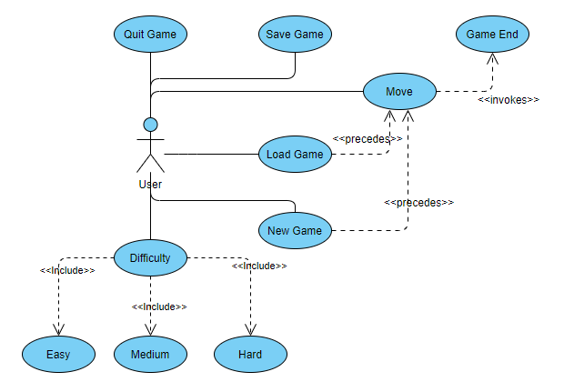
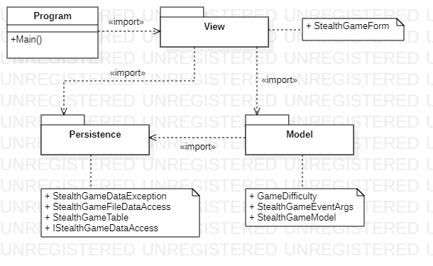
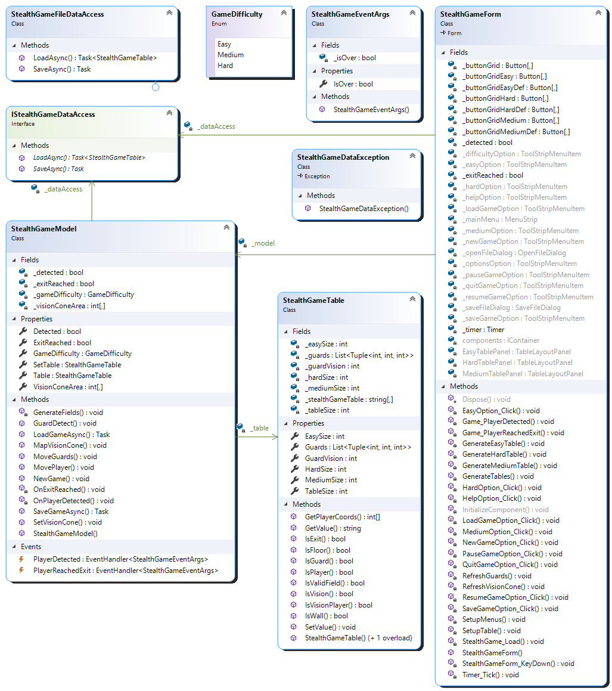

# StealthGame_WinForms
- A Stealth Game desktop app made with Windows Forms.
- © ELTE Event-driven applications, 2021/2022 Autumn semester

# Task documentation

## Task: (7: Stealth)

Create a program to play the following game.

Given a playing field of 𝑛 × 𝑛 elements, consisting of walls and floor, and patrolled by guards.
The player's task is to get from the starting point to the exit without being seen by the guards.
Of course, the player and the guards can only walk on the floor.

The guards move through a field (horizontally or vertically) at given intervals, moving forward
continuously until they hit a wall. They then randomly choose a new direction and continue in
that direction. While on patrol, the guard sees a 2 radius circle (i.e. a 5 × 5 square) but cannot
see through the wall.

The player starts at a predetermined point on the track and can move horizontally or vertically
(one at a time) around the track.

The size and structure (wall and exit positions, starting positions of players and guards) of the
maps are stored in a file. The program should contain at least 3 different sizes of courts.

The program should provide the possibility to start a new game by selecting a track, and to
pause the game (no time is passed and the player cannot move). Also recognise when the
game is over. Then display whether the player has won or lost.

# Analysis

- The game can be played with three difficulty levels: easy (20 × 20 board, 3 guards),
medium (30 × 30 board, 5 guards), hard (40 × 40 board, 8 guards). When the program
starts, it sets the difficulty to easy and automatically starts a new game.
- The task will be implemented as a one-stop desktop application using Windows Forms
graphical interface.
- In the window we place a menu with the following menu items: Options (New Game,
Load Game, Save Game, Quit Game), Pause, Resume, Help, Difficulty.
- The game board is represented by a grid of 𝑛 × 𝑛 (easy: 20 × 20, medium: 30 × 30,
hard: 40 × 40) push buttons, depending on the difficulty. The push buttons are only
used to form the grid, as the player can move by pressing the W,A,S,D keys. The player
is represented as a green circle, whose position is updated as he moves. The guards
are marked by red circles and their line of sight by light blue boxes, which are
constantly updated as the guards move. The exit is indicated by a green field.
- The game will automatically pop up a dialogue window when the game is over (the
player has been spotted by the guards or has escaped). Also dialog windows are used
to perform saving or loading (file names are given by the user) and a dialog window is
displayed when exiting the game to see if the user is sure they want to exit the game.

## Use cases

## Planning

### Programme structure

- The programme is implemented in a three-tier architecture. The
representation is in the `View` namespace, the model in the `Model`
namespace, and the persistence in the `Persistence` namespace.

### Persistence

- Data management is responsible for storing information about the
`StealthGame` board and ensuring that it is loaded/saved.
- The `StealthGameTable` class provides a valid `StealthGame` table (i.e. it
always checks the set values), where the value of each field is known. The table
provides the ability to retrieve and set values (`GetValue` and `SetValue`),
retrieve player coordinates (`GetPlayerCoords`), and check values
(`IsPlayer`, `IsExit`, `IsGuard`, `IsVision`, `IsVisionPlayer`, `IsWall`,
`IsFloor`, `IsValidField`).
- Long-term data storage is provided by the `IStealthGameDataAccess`
interface, which allows you to load (`LoadAsync`) and save (`SaveAsync`) the
table. The operations are implemented asynchronously for efficiency reasons.
- The interface for text file-based data management is implemented by the
`StealthGameFileDataAccess` class. Errors in file handling are indicated by
the `StealthGameDataException` exception.
- The program can store the data as text files with the extension `.stga`. This data
can be loaded into the program at any time and the current status can be saved.
- The first row of the file specifies the size of the table, the other rows and
columns of the file store the values of the table as a "matrix" of letters.

### Model

- The core of the model is implemented by the `StealthGameModel` class,
which controls the board's activities, as well as other parameters of the game:
`_detected` (whether the player has been detected) and `_exitReached`
(whether the player has reached the exit). The type provides the possibility to
start a new game (`NewGame`) and to move (`MovePlayer`). Before selecting a
new game, the difficulty level must be entered, and the table is generated
based on this. You can move the guards by advancing the time (`MoveGuards`).
- `PlayerDetected` and `PlayerReachedExit` events inform you about the
end of the game. The argument of the events (`StealthGameEventArgs`)
stores the state of the game.
- When the model is instantiated, it is provided with a data management
interface that allows you to load (`LoadGameAsync`) and save
(`SaveGameAsync`).
- The game difficulty is handled through the `GameDifficulty` enumeration
type, and the table sizes for each difficulty are stored in the
`StealthGameTable` class using read-only variables.

### View

- The view is provided by the `StealthGameForm` class, which stores an
instance of the model (`_model`) and a specific instance of the data access
(`_dataAccess`).
- The game board is represented by a button grid (`_buttonGrid`). For efficiency
reasons, all three difficulty tables are generated into a `TableLayoutPanel`
when the game is loaded, and are hidden/shown when changing the maps. In
the interface we create the corresponding menu items or dialog boxes and
their corresponding event handlers. Separate methods are used to generate
(`GenerateTables`), set (`SetupTable`) and update (`RefreshGuards`,
`RefreshVisionCone`) the game tables.
- The game timer (`_timer`), which is used to move the guards, is always
activated or deactivated during the game when certain menu functions are
running.

## Package diagram

## Class diagram

## Testing

1. The functionality of the model has been verified by unit tests within the
`StealthGameTest` project in the `StealthGameModellTest` class, using the
`MSTest` environment.
1. The following test cases have been implemented:
- `Model_NewGameEasyTest`, `Model_NewGameMediumTest`,
`Model_NewGameHardTest`: Start a new game depending on the difficulty,
check the difficulty and the size of the boards.
- `Model_PlayerMoveTest`: Check the player's move.
- `Model_PlayerReachedExit`: checks if the player has reached the exit and
the game is over.
- `Model_PlayerDetectedByPlayerMove`: checks if the player has entered
the guards' line of sight, if the game is over.
- `Model_PlayerDetectedByGuardMove`: check if the guards' vision screen
has entered the player, if the game is over. At the same time, the guards' move
is checked.
- `Model_LoadTest`: Test the loading of the game model with a mocked perperformance layer.
